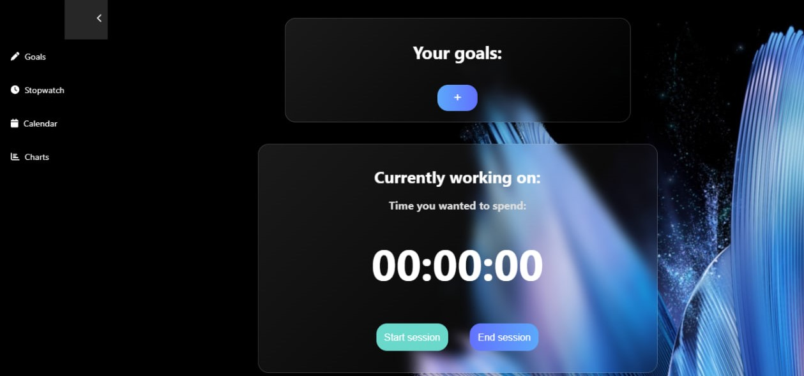

# Produo Frontend

This repository contains the frontend code for the Produo productivity app, a platform designed to help users stay focused, motivated, and productive throughout the day. The frontend is built using React and interacts with the backend API to provide a seamless user experience.

## Features
User Interface: A clean and intuitive UI that allows users to manage their goals and track their time effectively.

Goal Management: Users can create, edit, and delete goals directly from the interface.

Time Tracking: Users can log the time spent on tasks and visualize their progress through charts and summaries.

Local Storage: Instead of traditional user authentication, Produo uses local storage to separate user data, ensuring that each user's information is kept distinct on their device.

Responsive Design: The UI is fully responsive, providing a smooth experience on both desktop and mobile devices.

## Contributing

Contributions to this project are welcome! If you'd like to contribute, please follow these guidelines:
- **Fork the repository** and create a pull request with your changes.
- **Submit issues** for any bugs or feature requests.
  
## To Run;

### `cd productivity`
### `npm start`

